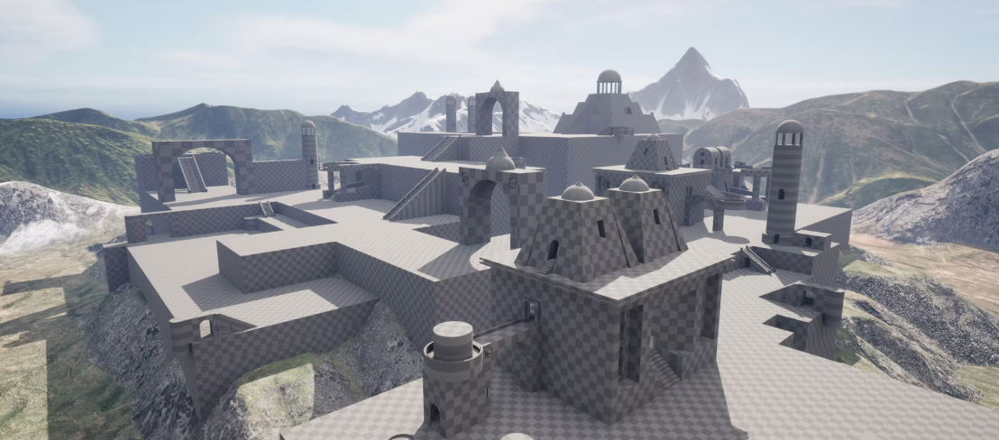
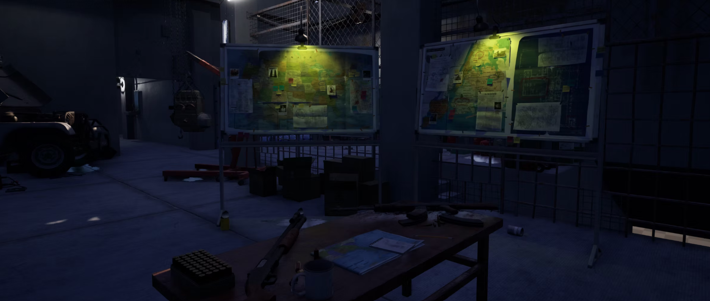
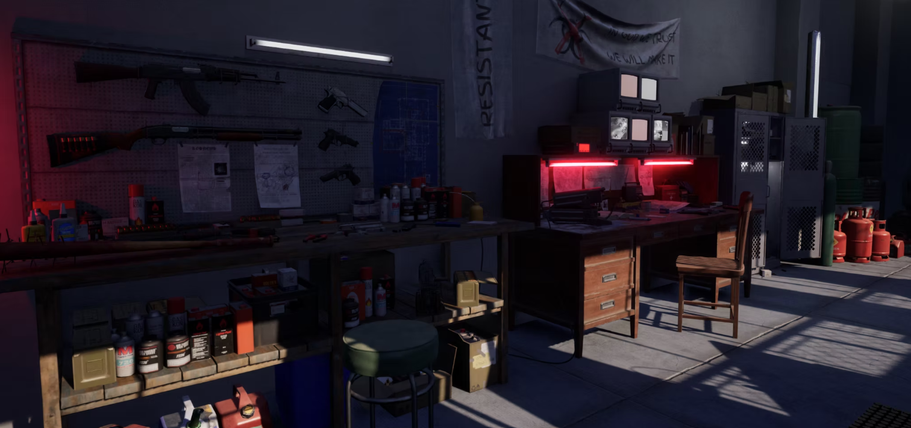
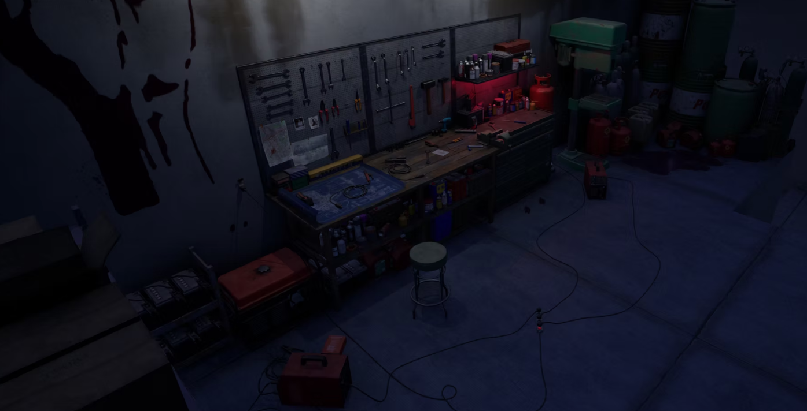
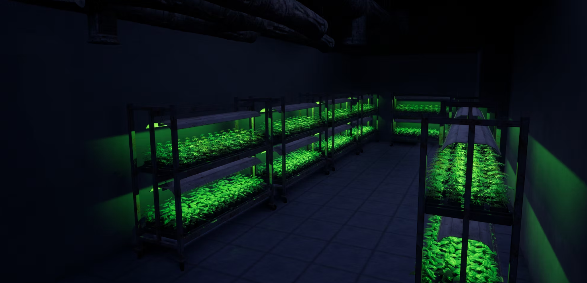
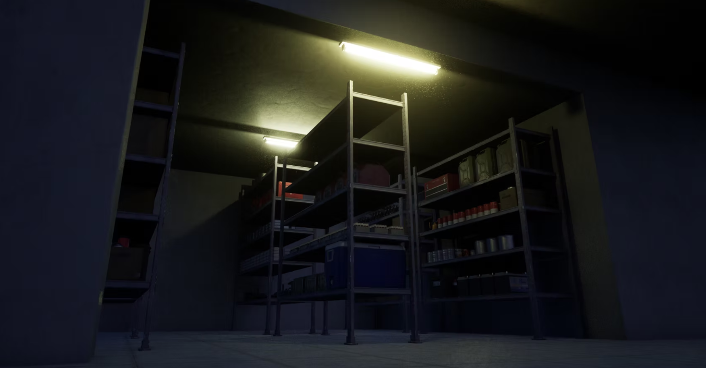
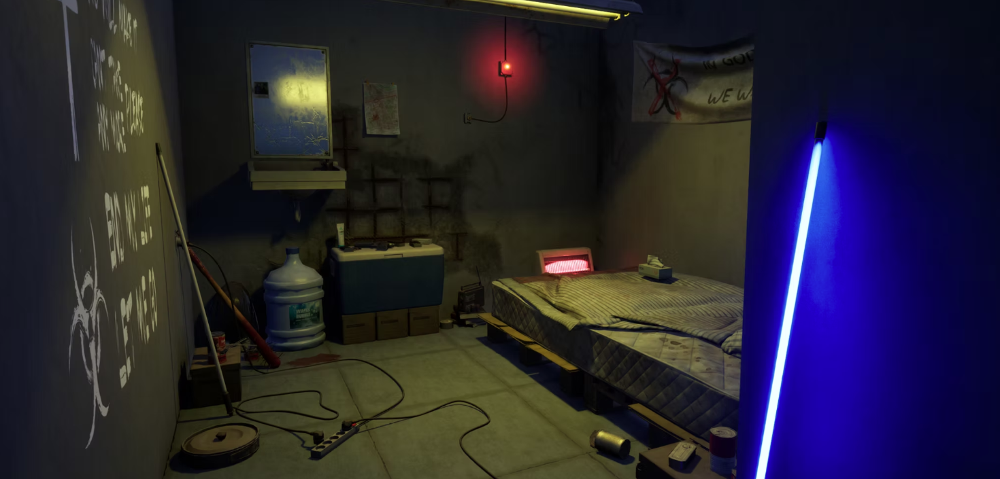

# Triiunion-Gaming-Studio (Associate-Product-Manager)
Led end-to-end product lifecycle  user research, persona definition, MVP scoping, GTM strategy, and post-launch iteration. Identified retention drop-off points through data analysis and ran rapid experimentation cycles, driving measurable improvements in Day-1 and Day-7 retention metrics across the user base.

                         ------------------------------- x -------------------------------
                         ------------------------------- x -------------------------------

🎮 **Triiunion Gaming Studio**

A culturally localized, real-time multiplayer PvP mobile game built for Indian audiences — shipped by a lean team, and sunset post-launch after honest assessment of traction and market fit.

🧠**Overview**

Indian mobile gamers are underserved by global titles that feel culturally disconnected and perform poorly on low-end devices. Triiunion Gaming Studio set out to change that — building a real-time PvP action game tailored to local themes, local hardware, and local moments.

Despite strong execution and a passionate beta community, post-launch data revealed challenges with retention and organic growth. The team made the deliberate decision to sunset the game and document the learnings.

🚀 **The Problem**

**Challenge	Impact**

1. Global games feel culturally disconnected for Indian players	Low engagement, poor resonance
2. Low-end Android devices struggle with real-time gameplay	High churn due to performance issues
3. No localized characters, cosmetics, or monetization	Players don't see themselves in the game
4. Retention remains a major gap in the Indian mobile gaming ecosystem	High DAU drop-off after first week

🧪 **What We Built**

Game Concept
Real-time PvP action game with short-session combat designed for India's usage patterns
Culturally themed characters, maps, and seasonal events
Optimized for low-end Android devices from day one

**Core Features**

**Feature	Details**
⚡ Fast Matchmaking	Under 10 seconds
📦 Lightweight Assets	Offline fallback support
🎉 Festival IAPs	Cosmetic bundles tied to Indian festivals & local events
🤝 Community	Discord + Instagram integration

🧭**My Role**
1. Product Lead — end-to-end ownership from concept to sunset.
2. Defined product vision and execution roadmap
3. Led market research, MVP scoping, and core game design
4. Recruited and managed a lean, cross-functional team (art, animation, sound)
5. Owned go-to-market strategy, content calendar, and community engagement
6. Designed an in-app monetization system aligned with cultural moments and local pricing behavior
7. Ran closed beta testing with feedback loops via Discord and Instagram
8. Led post-launch analysis and made the call to sunset based on performance data

✅**What Worked**
1. Shipped a real-time PvP game that ran smoothly on low-end Android devices
2. Strong community engagement during beta via Discord and Instagram
3. Cultural cosmetic bundles saw high click-through and player interest
4. Maintained a fast, agile development loop with a small, focused team

⚠️**What Didn't Work**
1. Organic growth was slower than expected post-launch
2. Retention dropped significantly after the first week
3. Monetization didn't scale beyond early adopters
4. Visibility and user acquisition were difficult to compete on without heavy ad spend

🌅 **Why We Sunset the Game**
After launch, the data told a clear story:
1. Lower-than-expected daily active users despite strong beta enthusiasm
2. Challenges scaling player acquisition without paid channels
3. Early retention signals pointed to weak product-market fit
4. Rather than burning resources chasing uncertain traction, the team chose to sunset deliberately — a decision made from data, not emotion.

🎓**Key Learnings**
1. Timing and go-to-market channels matter as much as game quality
2. Cultural alignment boosts engagement, but retention hinges on core mechanics
3. Low-end device optimization must be a design constraint from day one
4. Community-building is powerful, but needs support from in-product loops
5. Knowing when to pivot or shut down is a strength, not a failure

💡**Designs**

🏷️ **Tags**

Mobile Gaming · PvP · Android · Real-time Multiplayer · India · Product Management · Go-to-Market · Community Building · Monetization · Sunset

**Built with a lean team. Shipped with intention. Sunset with clarity.**

